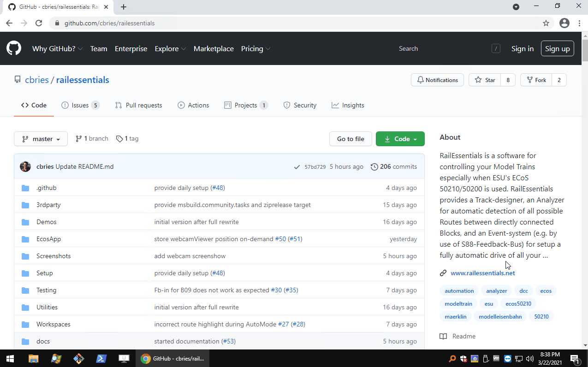

## RailEssentials - MIT License

**~~RailwayEssentials~~** is renamed to **RailEssentials**.

**[`RailEssentials`](http://www.railessentials.net)** is a modern and intuitive software for creating and controling
model railways. Currently, the only supported control unit 
is [ESU's ECoS 50210/50200](http://www.esu.eu/produkte/digitale-steuerung/ecos-50210-zentrale/was-ecos-kann/). 
The software is based on a client-server architecture, i.e the server is the brain and bridge between the control unit
and any conntected webclient. The server is written in C# and .NET Framework and the client is written in JavaScript/TypeScript and can be
used in [Chrome](https://www.google.com/chrome/), [Firefox](https://www.mozilla.org/en-US/firefox/new/), 
and [Vivaldi](https://vivaldi.com/). 

# Table of Contents
- [Daily/Nightly Builds](#dailynightly-builds)
- [Releases](#releases) 
- [Who is Using It?](#who-is-using-it)
- [Contribute](#contribute)
- [Book](#book)
- [Features](#features)
- [Visual Impressions](#visual-impressions)
- [Wiki/Documentation](https://github.com/cbries/railessentials/wiki/Topics---Table-of-Content)

 

# Daily/Nightly Builds

### Setup/Installer

`RailEssentials` is automatically build everyday. During this build an always up-to-date Setup/Installer is generated and can be used to deploy the latest features on your personal computer. Currently, only Windows is supported, for other operating system the source must be used and build. The latest setup/installer is provided under the `Release`tab: [`Daily Setup`](https://github.com/cbries/railessentials/releases/tag/dailybuild)
- download the Setup of your choice (e.g. `Setup-20210322-4d9eb4.exe`, where `20210322` stands for 22nd March 2021)
- doubleblick the Setup and follow the instructions

### Portable Zip-Archives

`RailEssentials` is automatically build everyday. The always latest version is provided under the `Release` tab: [`Daily Build`](https://github.com/cbries/railessentials/releases/tag/dailybuild)
- download the archive `railessentials-dailybuild-*.zip`
- after unzip just call the included script `startRailEssentials.bat`

As default the workspace `Basement` is loaded and provided and can be used directly in simulation mode.

![Locomotives]

 

# Releases

We do not provide any official releases yet, because the software is still under development, but we provide a [`Daily Build`](https://github.com/cbries/railessentials/releases/tag/dailybuild). In January'21 the RailEssentials team decided to do a full rewrite. To use this software, checkout the source, and just click "Build and Run (F5)" in VisualStudio.

 

# Contribute

## Quick Start for Developer

- install [`VisualStudio 2019`](https://visualstudio.microsoft.com/vs/) or the old variant [`VisualStudio 2017`](https://visualstudio.microsoft.com/vs/older-downloads/)
- clone the RailEssentials repository `git clone https://github.com/cbries/railessentials.git` or download the latest archive [master.zip](https://github.com/cbries/railessentials/archive/master.zip)
- open the solution `railessentials.sln`
- set `railessentials` as _Startup Project_
- click `F5` or call `VisualStudio Toolbar / Debug / Start Debugging`

As a result the software will build and all relevant files are copied to the `Output Directory`, in general this is `railessentials \ bin \ Debug|Release`. `railessentials.exe` will be executed, a command prompt opens and shows some status information. If not browser opens automatially, go to your browser and open `http://localhost:8081/?workspace=Basement`.

Finally, you should see something like this:
![firstImpressionsAfterBuild]

[firstImpressionsAfterBuild]: docs/assets/img/firstImpressionAfterBuild.png "Welcome View of RailEssentials after Build and Run"

## System Requirements

- Windows 10
- .NET Framework 4.8 or higher
- `Chrome`, `Firefox` or `Vivaldi`

## Bug Tracking

Have a bug or a feature request? Please open an issue here [https://github.com/cbries/railessentials/issues](https://github.com/cbries/railessentials/issues). Please make sure that the same issue was not previously submitted by someone else.

## Third-Party Components at Their Best

- [`w2ui`](http://w2ui.com/web/) JavaScript UI Library for the Modern Web
- [`WebSocket4Net`](https://github.com/kerryjiang/WebSocket4Net) A popular .NET WebSocket Client
- [`SuperSocket`](https://github.com/kerryjiang/SuperSocket) SuperSocket is a light weight extensible socket application framework.
- [`Newtonsoft`](https://www.newtonsoft.com/json) Popular high-performance JSON framework for .NET
- [`jQuery`](https://jquery.com/) jQuery is a fast, small, and feature-rich JavaScript library.
- [`jQuery colorpicker`](https://github.com/vanderlee/colorpicker) A full-featured colorpicker for jQueryUI with full theming support.
- [`jQuery Boxfit`](https://github.com/michikono/boxfit) Boxfit is a jQuery plugin for resizing text.
- [`Contextual.js`](https://github.com/LucasReade/Contextual.js) Javascript contextual menu library
- [`select2`](https://github.com/select2/select2) Select2 is a jQuery based replacement for select boxes. It supports searching, remote data sets, and infinite scrolling of results.
- [`FontAwesome`](https://fontawesome.com/) Get vector icons and social logos on your website with Font Awesome, the web's most popular icon set and toolkit.
- [`emgucv`](https://github.com/emgucv/emgucv) A cross platform .Net wrapper for the Open CV image-processing library.

 

# Book

In the late of 2018 I wrote a book about programming the ESU's ECoS 50210.

 

* ISBN: **978-1-790-36403-9**    
* ASIN (Kindle): **B07L4Z4MYL**

The book introduces the basics of managing commands for remote control of your model railway by use of C# and .NET Framework/.net Core. The included examples and API information are all used in [`ecos`](https://github.com/cbries/ecos), a software library hosted on GitHub which is completly used by `RailEssentials` (with few improvements and bug fixes). The source is completly merged into `RailEssentials`, i.e. check out the subdirectory [`ecoslibNet48`](https://github.com/cbries/railessentials/tree/master/ecoslibNet48).

 

## Features

 - *Modern Web Frontend* based on HTML5, JavaScript, Websocket-Communication
 - *Frontend UI usable with Chrome, Firefox, Vivaldi, Edge* on any device
 - *Server-based* architecture (currently the server is only running on Windows)
 - *WebCam/Video* support included by default for monitoring hidden yards (i.e. includes stream server and web viewer) [Wiki](https://github.com/cbries/railessentials/wiki/RailEssentials'-WebCam-Video-Surveilance-for-Fiddle-Yards)
 - *Import of Rocrail* plans [Wiki](https://github.com/cbries/railessentials/wiki/Import-RocRail-plan.xml)
 - *Workspace* support, to switch between different plan at any time
 - *Track Designer* based on modern web technology
 - *Toolbox-support* with drag&drop
 - *Plan Item* transformation directly by single clicks (i.e. move, rotate, remove)
 - *Text Item* support (i.e. bold, italic, underline, font size, font color)
 - *Labels* for Plan Items
 - *Block-based* automatic mode, any train/locomotive can be controlled by a smart algorithmen and can travel between blocks without crossing routes
 - *Route detection* between blocks, any feasible route will be found and provided for your individual setup
 - *Routes with direction* are recognized
 - *Route* disabling/enabling on-demand
 - *Block* disabling/enabling on-demand
 - *Locomotive* lock/unlock
 - *Locomotive* direct control via mouse over controls in the plan
 - *Locomotive* speed curve editor (i.e. individual acceleration/deceleration)
 - *Locomotive* image visualization [Wiki](https://github.com/cbries/railessentials/wiki/Adding-Locomotive-Images-Photos)
 - *Drag&Drop of Locomotives* to Blocks for assignment
 - *Light Control* (i.e. currently hardcoded variant for my personal model railway)
 - *S88 Viewer*
 - *Simulation Mode* to test any functionality
 - *Accessory* can be changed directly by clicking the individual plan item at any time
 - *Block entering* visualization, see directly on which side the locomotive has entered the block and on which side it will leave the block
 - *Locomotive Options* for AutoMode (e.g. change of direction, different kind of trains, etc.)
 - *Auto Mode* of the whole model railway, work on your landscape during run of all your trains
 - *Statistics* of accessory usage and when any Locomotive has been started/stopped (e.g. supports scheduled maintenance)

 

# Visual Impressions

## Locomotive Control

![LocomotivesControl]

![LocomotivesView]

![LocomotivesSpeedCurve]

## Accessories

![Accessories]

## WebCam/Video Surveilance for Fiddle Yards

![WebCam]

## Blocks and S88

![BlocksS88]

![S88Viewer]

## Routing

![Routes]

![RoutesAnalyzing]

## Edit

![Labels]

![Toolbox]

![WorkspaceSelection]

[Locomotives]: Screenshots/Impressions/RailEssentials-Locomotives.png "Locomotives View and Handling"
[LocomotivesControl]: Screenshots/Impressions/RailEssentials-LocomotivesControl.png "Locomotives Control directly in the Plan"
[LocomotivesView]: Screenshots/Impressions/RailEssentials-LocomotivesView.png "Locomotives View"
[LocomotivesSpeedCurve]: Screenshots/Impressions/RailEssentials-SpeedCurve.png "Locomotives SpeedCurve"

[Accessories]: Screenshots/Impressions/RailEssentials-Accessories.png "Accessories"

[WebCam]: Screenshots/Impressions/railessentials01.png "WebCam0"

[BlocksS88]: Screenshots/Impressions/RailEssentials-BlocksS88.png "Blocks and S88"
[S88Viewer]: Screenshots/Impressions/RailEssentials-S88Viewer.png "S88 Viewer"

[Routes]: Screenshots/Impressions/RailEssentials-Routes.png "Routes"
[RoutesAnalyzing]: Screenshots/Impressions/RailEssentials-RoutesAnalyzing.png "Routes Analyzing"

[Labels]: Screenshots/Impressions/RailEssentials-Labels.png "Labels in Track"
[Toolbox]: Screenshots/Impressions/RailEssentials-Toolbox.png "Toolbox to create any Plan individually"
[WorkspaceSelection]: Screenshots/Impressions/RailEssentials-WorkspaceSelection.png "Workspace Selection"
